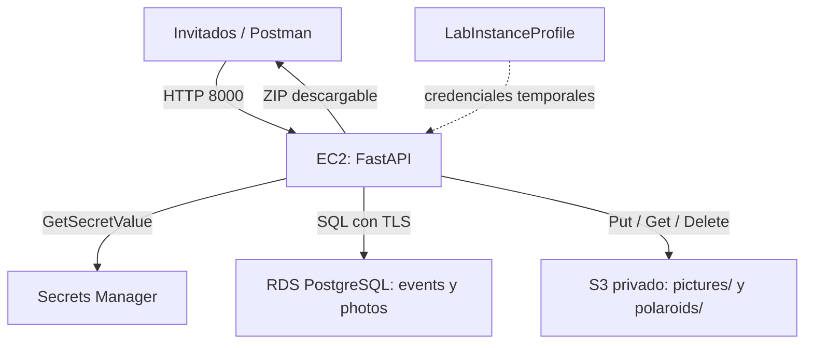

# Álbum Polaroid para eventos

Backend académico en Python + FastAPI, EC2, S3, RDS PostgreSQL y Secrets Manager.
Permite atender varios eventos y descargar un ZIP por evento. No incluye frontend:
puedes usar Swagger en `/docs`, Postman o curl. Preparado para desplegar; la prueba
real en AWS y el video deben realizarse en tu cuenta. No se han creado recursos.

## 1. Arquitectura y decisiones



- `pictures/{event_id}/{uuid}.jpg`: versión reducida EXACTAMENTE a 128×128.
- `polaroids/{event_id}/{uuid}.jpg`: marco blanco, foto y mensaje, 1020×1320,
  con metadatos de 300 dpi (aprox. 8.6×11.2 cm). La calidad depende de la entrada.
- La foto recibida de alta resolución solo se usa durante el procesamiento. La
  polaroid se compone desde ella para no ampliar una miniatura de 128×128.
- `/finish` arma el ZIP y después elimina las imágenes de `pictures/` del evento.
  Conserva las polaroids y su metadata para reintentar una descarga. `original_deleted`
  indica que la ruta histórica en RDS ya no apunta a un original existente.
- Subidas y cierre bloquean la fila del evento para evitar que una foto llegue
  mientras se está cerrando. Eventos distintos pueden procesarse por separado.
- S3 y RDS no tienen transacción común. Se intenta limpiar S3 si falla una subida;
  ante caída del proceso puede quedar un objeto huérfano, que elimina el teardown.
- Límite de imagen: 10 MiB, 24 millones de píxeles; JPEG/PNG/WEBP. Mensaje: 1–300
  caracteres. Fuente incluida por el SO: texto latino con acentos; evitar emojis.
- Alcance académico: sin autenticación ni limitación de peticiones. Restringe el
  acceso HTTP a tu IP durante la demostración. No usar así para un evento real.

## 2. Crear recursos en AWS Console

Usa una sola región, por ejemplo `us-east-1`, si tu laboratorio la permite. Los
nombres de menús y tipos de instancia disponibles pueden variar por laboratorio.
Si una operación devuelve AccessDenied, verifica los permisos con tu profesor.
No crees un usuario IAM ni pongas credenciales personales en EC2.

1. **Red**: usa la VPC predeterminada si está disponible. Para EC2 elige una subred
   pública con ruta `0.0.0.0/0` al Internet Gateway y asignación de IPv4 pública.
   RDS debe estar en la misma VPC y su subnet group debe cubrir al menos dos AZ.
   No es necesario crear NAT, load balancer ni Elastic IP para esta práctica.
2. **Security groups dedicados**:
   - `polaroid-ec2-sg`: entrada TCP 22 y 8000 desde TU_IP/32; salida predeterminada.
   - `polaroid-rds-sg`: entrada PostgreSQL TCP 5432, origen el ID de
     `polaroid-ec2-sg`. No abras PostgreSQL a Internet.
3. **S3**: crea un bucket de propósito general con nombre globalmente único,
   bloqueo de acceso público activado, cifrado predeterminado y **sin versionado**,
   sin Object Lock. No activar versionado posteriormente: un delete con versionado
   conservaría versiones antiguas y no cumpliría el borrado físico del original.
   No tienes que crear carpetas: S3 las muestra al subir objetos con esos prefijos.
4. **RDS**: creación estándar, PostgreSQL, instancia única (Single-AZ), clase
   pequeña permitida por el laboratorio, almacenamiento mínimo permitido.
   Identificador `polaroid-db`, usuario maestro `polaroid_admin`, contraseña
   autoadministrada. En configuración adicional establece el nombre inicial de
   base de datos **`polaroid`**. Misma VPC, SG `polaroid-rds-sg`, acceso público
   **No**. Para esta práctica temporal desactiva protección contra eliminación y
   define retención de backups en 0 si el laboratorio lo permite. Espera Available.
   Guarda la contraseña en el siguiente paso; no en archivos del repositorio.
5. **Secrets Manager**: crea un secret (otro tipo de secreto, pares clave/valor)
   llamado `polaroid/rds`, usando la clave administrada `aws/secretsmanager`:

   | Clave | Valor |
   |---|---|
   | host | Endpoint DNS de RDS, sin protocolo ni puerto |
   | port | 5432 |
   | dbname | polaroid |
   | username | polaroid_admin |
   | password | Contraseña real establecida al crear RDS |

   No es necesario activar rotación para la actividad. No grabes ni publiques el
   valor del secreto; en el video muestra su nombre y descripción.
6. **EC2**: Ubuntu Server 24.04 LTS, arquitectura x86_64, instancia pequeña permitida
   (preferible 2 GiB de RAM para procesamiento de fotos), misma VPC, IPv4 pública,
   SG `polaroid-ec2-sg`, almacenamiento raíz con Delete on termination, key pair
   existente. En Advanced details asigna IAM instance profile **LabInstanceProfile**
   y requiere IMDSv2. No crees ni elimines el perfil compartido del laboratorio.
7. Verifica que el rol de ese perfil permita `secretsmanager:GetSecretValue` para
   tu secret y `s3:PutObject`, `s3:GetObject`, `s3:DeleteObject` en tu bucket. Con
   una clave KMS personalizada también necesitarías permisos KMS; por eso usamos
   las claves predeterminadas. Si el laboratorio restringe IAM, no intentes cambiar
   sus roles: confirma el permiso disponible con el docente.

**Anota los IDs de tus recursos** en una copia de `resources.example.env` llamada
`resources.env`. Ese archivo es para limpiar, no para arrancar la aplicación.
No elimines la VPC, subnet group predeterminado, key pair compartido ni LabInstanceProfile.

## 3. Subir código y arrancar EC2

Sube este contenido a tu repositorio GitHub (sin claves, `.env` ni recursos reales).
Desde la carpeta extraída, en Git Bash o una terminal:

```bash
git init
git add .
git commit -m "Backend de álbum Polaroid en AWS"
git branch -M main
git remote add origin https://github.com/TU_USUARIO/TU_REPOSITORIO.git
git push -u origin main
```

Crea antes un repositorio vacío en GitHub. Entra a EC2 por SSH o el mecanismo
permitido por tu laboratorio. Estos comandos se ejecutan **dentro de EC2**:

```bash
sudo apt-get update
sudo apt-get install -y python3-venv python3-pip fonts-dejavu-core git
cd /home/ubuntu
git clone https://github.com/TU_USUARIO/TU_REPOSITORIO.git polaroid-events
cd polaroid-events
python3 -m venv .venv
.venv/bin/pip install -r requirements.txt
sudo cp config.example.env /etc/polaroid.env
sudo nano /etc/polaroid.env
```

Reemplaza región, bucket y nombre/ARN del secret. **Solo son identificadores**:
no agregues `DB_PASSWORD`, `DATABASE_URL`, `AWS_ACCESS_KEY_ID` ni otras credenciales.
El backend rechaza proveedores de credenciales distintos al rol de instancia.

```bash
sudo tee /etc/systemd/system/polaroid.service >/dev/null <<'SERVICE'
[Unit]
Description=API Polaroid
After=network-online.target
Wants=network-online.target

[Service]
User=ubuntu
WorkingDirectory=/home/ubuntu/polaroid-events
EnvironmentFile=/etc/polaroid.env
ExecStart=/home/ubuntu/polaroid-events/.venv/bin/uvicorn app.main:app --host 0.0.0.0 --port 8000
Restart=on-failure
RestartSec=5

[Install]
WantedBy=multi-user.target
SERVICE
sudo systemctl daemon-reload
sudo systemctl enable --now polaroid
sudo systemctl status polaroid --no-pager
```

Al iniciar se crean automáticamente las dos tablas mediante `app/schema.sql`.
Abre `http://IP_PUBLICA_EC2:8000/docs`. Si reinicias o detienes/inicias EC2, verifica
su IP y actualiza tus URLs. No hace falta correr `aws configure` en EC2.

## 4. Prueba completa de endpoints

Puedes usar **Try it out** en `/docs`. `/upload` recibe `multipart/form-data`,
no JSON. Las otras llamadas POST reciben JSON. Los comandos siguientes son para
**Git Bash** (en PowerShell usa `curl.exe` y adapta las comillas o usa Swagger).

```bash
BASE=http://IP_PUBLICA_EC2:8000
curl --fail-with-body -X POST "$BASE/events" \
  -H 'Content-Type: application/json' \
  -d '{"client_name":"Ana y Luis","event_type":"Boda","event_date":"2026-10-10"}'
# Copia el event_id recibido:
EVENT_ID=UUID_DEVUELTO
curl --fail-with-body -X POST "$BASE/upload" -F "event_id=$EVENT_ID" \
  -F 'message=¡Muchas felicidades!' -F 'photo=@foto1.jpg'
curl --fail-with-body -X POST "$BASE/upload" -F "event_id=$EVENT_ID" \
  -F 'message=Que vivan muchos momentos felices.' -F 'photo=@foto2.jpg'
curl --fail-with-body -X POST "$BASE/upload" -F "event_id=$EVENT_ID" \
  -F 'message=Gracias por compartir este día.' -F 'photo=@foto3.jpg'
curl --fail-with-body "$BASE/events/$EVENT_ID"
curl --fail-with-body -X POST "$BASE/finish" \
  -H 'Content-Type: application/json' \
  -d "{\"event_id\":\"$EVENT_ID\"}" -o album.zip
```

Usa tres imágenes propias; no se incluyen fotografías de invitados en el repo.
GET debe mostrar `photo_count: 3`. Descomprime `album.zip`: deben aparecer tres JPG
con marco y mensaje. Repite GET: `status` debe ser `finished` y el conteo sigue en 3.
Antes de finish muestra en S3 las 3 imágenes por prefijo; después deben quedar las
3 polaroids y desaparecer los 3 objetos de `pictures/` correspondientes al evento.
Prueba otro evento si deseas comprobar aislamiento.

Respuestas: 201 creado, 404 evento inexistente, 409 evento cerrado o sin fotos,
422 entrada inválida, 503 fallo interno de servicios. Un cierre repetido vuelve a
generar el ZIP; una subida repetida crea otra foto (no es idempotente).

## 5. Evidencia de las tablas y del instance profile

RDS Console muestra la instancia, **no es un explorador general de tablas para
una instancia PostgreSQL estándar**. Muestra RDS Console y luego ejecuta en EC2:

```bash
cd /home/ubuntu/polaroid-events
set -a
source /etc/polaroid.env
set +a
.venv/bin/python -m app.inspect_db
```

Esto consulta RDS con el mismo secret sin mostrar su contraseña. `schema.sql`
permite explicar la PK y FK. También puedes usar un cliente SQL con túnel SSH,
pero no es necesario abrir RDS públicamente para la evidencia.

Para evidenciar el **nombre del instance profile**, en CloudShell:

```bash
aws ec2 describe-instances --instance-ids i_TU_ID \
  --query 'Reservations[].Instances[].IamInstanceProfile.Arn' --output text
```

Reemplaza `i_TU_ID` por el identificador real `i-...`. El ARN debe terminar en
`instance-profile/LabInstanceProfile`. La consola de EC2 puede mostrar el nombre
**del rol** (por ejemplo LabRole), que no es el nombre del perfil. Muestra ambos.

## 6. Video: guion de 5–10 minutos

| Tiempo aproximado | Evidencia |
|---|---|
| 0:00–0:45 | Objetivo, diagrama y URL pública de EC2 |
| 0:45–1:30 | EC2, security group, rol e instance profile |
| 1:30–3:15 | POST /events y tres POST /upload con mensajes distintos |
| 3:15–4:15 | GET: metadata y conteo 3; S3 con los dos prefijos |
| 4:15–5:15 | RDS Console, tablas consultadas desde EC2, nombre del secret |
| 5:15–6:30 | POST /finish, abrir ZIP y mostrar las tres polaroids |
| 6:30–7:00 | S3: eliminación de originales; GET: finished |
| 7:00–9:30 | CloudShell: teardown y evidencia de eliminación |

La eliminación de RDS puede tardar más que el video completo. Graba el inicio,
pausa/corta la espera e indica que omitiste el tiempo de aprovisionamiento. Retoma
con la salida real; no simules resultados ni omitas errores. Nunca muestres el
valor del secret, claves AWS o el contenido de un archivo `.pem`.

## 7. Eliminar recursos

Ejecuta desde **AWS CloudShell en el laboratorio**, NO por SSH dentro de EC2: esa
instancia será terminada. Esto usa la sesión autorizada del laboratorio para
administrar recursos; **el backend** sigue usando únicamente LabInstanceProfile.

Sube `teardown.sh` y `resources.example.env` a CloudShell:

```bash
cp resources.example.env resources.env
nano resources.env
bash teardown.sh
```

Revisa los IDs, luego escribe `ELIMINAR`. El script borra datos sin snapshot final,
termina EC2, elimina RDS y sus backups automáticos, vacía/elimina el bucket, elimina
el secret y los dos SG dedicados. Elimina un DB subnet group solo si especificaste
uno propio; no elimina recursos compartidos. No hemos ejecutado este script.

Si el waiter de RDS vence, la eliminación puede seguir en curso. Ejecuta
`aws rds wait db-instance-deleted --db-instance-identifier polaroid-db` y después
las eliminaciones de SG pendientes del script. Si hay `DependencyViolation`,
espera a que desaparezcan las interfaces de RDS antes de volver a eliminar esos
SG. No repitas todo el script cuando ya faltan recursos: continúa desde el paso
fallido y verifica la consola. Cualquier AccessDenied necesita resolución, no
cuenta como éxito. El borrado del secret es asíncrono: si muestra `DeletedDate`,
vuelve a consultar hasta recibir `ResourceNotFoundException`.

Comprueba EC2 `terminated` (puede seguir visible), RDS ausente, bucket ausente,
secret ausente, SG ausentes. Si añadiste recursos fuera de esta guía (snapshots
manuales, EIP, volúmenes extra, NAT, backups retenidos), elimínalos por separado.
No borres el perfil LabInstanceProfile ni la red compartida del laboratorio.

## 8. Pruebas y diagnóstico

```bash
python -m venv .venv
source .venv/bin/activate
pip install -r requirements-dev.txt
pytest -q
```

Pruebas locales con dobles de servicios: procesamiento, validación, aislamiento,
ZIP y flujo de cierre. No sustituyen la prueba real de permisos, red, RDS y S3.
Dependencias con rangos de versiones mayores; después de verificar en EC2 puedes
registrar las versiones exactas con `pip freeze > requirements-lock.txt`.

- Servicio no inicia: `sudo journalctl -u polaroid -n 60 --no-pager`.
- Conexión RDS: estado Available, nombre de BD, endpoint del secret y SG 5432.
- Credenciales AWS: revisar instance profile, IMDS habilitado y ausencia de claves
  en el entorno/archivos de credenciales del usuario ubuntu.
- Acceso S3/secret denegado: permisos del rol y región/identificadores correctos.
- Navegador no conecta: IPv4 pública, SG 8000 desde IP actual y servicio activo.
- Texto sin fuente: instalar `fonts-dejavu-core` o configurar `FONT_PATH`.

## 9. Reporte y uso de IA

`docs/reporte-borrador.pdf` es un borrador de dos páginas sin portada. Revisa nombre,
fecha y estado de validación antes de entregarlo; no afirma un despliegue que aún
no ocurrió. Su fuente editable es `docs/generar_reporte.py` (requiere reportlab).
La declaración de IA describe el apoyo recibido y debe ajustarse a lo que hayas
revisado, entendido, modificado y probado realmente.

Documentación oficial consultada:
- https://docs.aws.amazon.com/boto3/latest/guide/credentials.html
- https://docs.aws.amazon.com/secretsmanager/latest/userguide/retrieving-secrets-python-sdk.html
- https://docs.aws.amazon.com/AmazonRDS/latest/UserGuide/USER_ConnectToPostgreSQLInstance.html
- https://fastapi.tiangolo.com/tutorial/request-forms-and-files/
